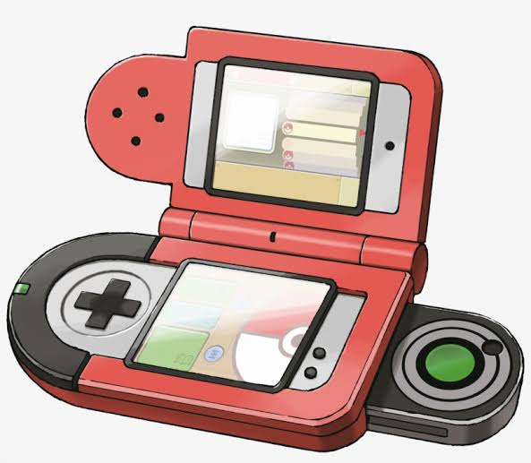

---

# Projeto Pokedex WebApp - <a href="https://first-project-pokedex-rs.netlify.app/">Acesse aqui</a>

  

  
Este é um Projeto proposto no servidor do discord Aopa, Mundo! Com finalidade de conhecimento e desafio para nossos saberes para criar uma Pokedex utilizado a API PokeAPI. O app tem a seguinte funcionalidade, funcionar como uma pokedex, possui os 151 pokemons da primeira geração, e com um clique acima deles é possivel obter algumas informações sobre o mesmo.

Este repositório tem finalidades de treinamento e adiquerimento de conhecimentos em programação, não foi feito para distribuição e nem venda.

### Projeto:

Este foi meu primeiro projeto, fui responsável pelo HTML e CSS e meu amigo, o samuelllr, me responsou pelo JS. Com certeza não foi aquele projeto, está cheio de más práticas, porém foi um projeto muito bom, eu gostei muito do que ele fez e deu o pontapé inicial para o desenvolvimento.

## Aopa Mundo!

- Convite para o servidor: https://discord.gg/fbRPr4btND
- PokeAPI:https://pokeapi.co

---

### Atualização do APK:

- 12/07/21
- version: 1.3.

### Autores:

- samuelllr
- Ryan-drop
